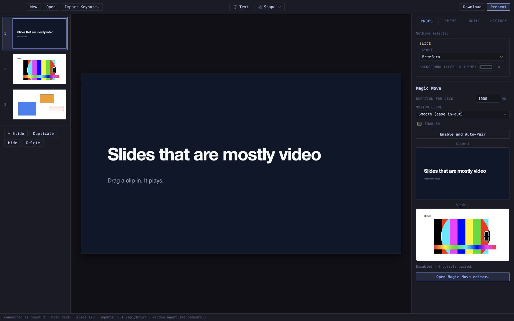

# Slide editor UI status

Status: the experimental UI rework was reverted on 18 August 2026.

The editor again uses the layout and styling from commit `7b8cacf`:

- New, Open, and Import Keynote are direct controls at the top left.
- Text and Shape remain separate controls in the center.
- Agent, Collaborate, and Present remain direct controls at the right.
- Props, Theme, Build, and History are the sidebar tabs.
- Layout and Magic Move are back in Props.
- The slide rail again shows Slide, Duplicate, Hide, and Delete directly.

The file-format actions are consolidated under **Save As…**. Its menu contains
**Deck…**, **PDF (export, lossy)…**, and **Web…**.

The screenshot uses the collaboration renderer, which shares the editor canvas,
rail, inspector, toolbar geometry, and original stylesheet. The desktop toolbar
also includes Agent and Collaborate, plus the Save As menu.

The earlier experimental screenshots remain in `docs/assets/ui-audit/` only as
historical comparison artifacts. They do not describe the current interface.
